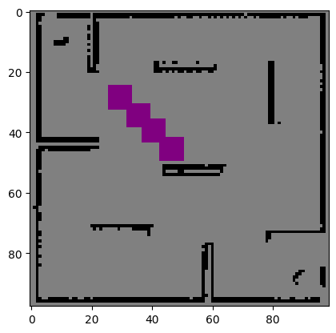
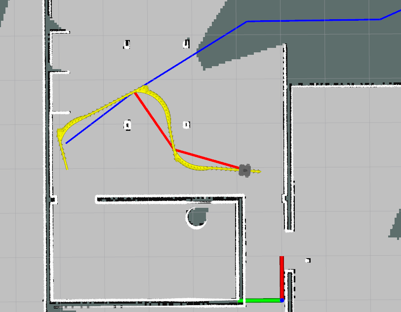
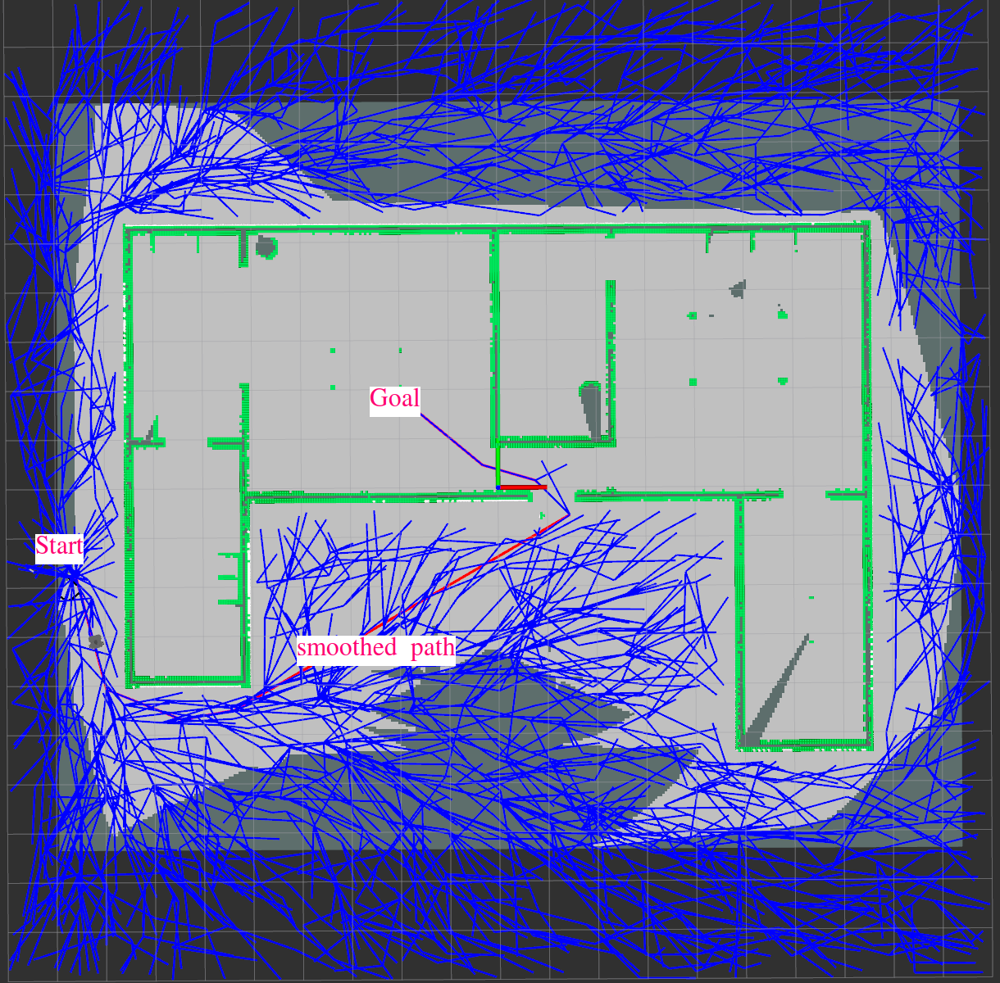
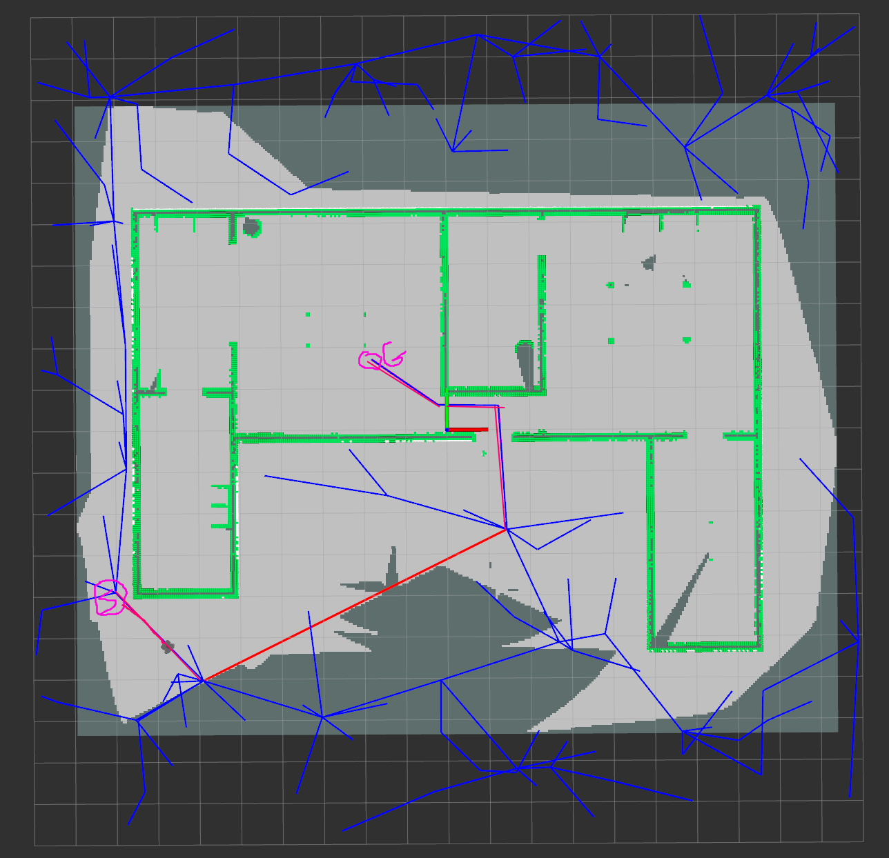
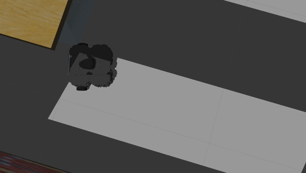

# Online Path Planner lab1

### Group Members 
   1. Eliyas Kidanemariam Abraha - u1992469
   2. Goitom Leaku  u1985499

## Table of Contents
1. [Introduction](#introduction)
2. [Implementation](#features)
3. [Usage](#usage)
4. [Demo Video](#demo)

## Introduction
The lab integrated concepts from occupancy grid mapping and path planning to navigate the robot from its current position to a goal position while avoiding obstacles in the environment. This report presents an overview of the project, its architecture, implementation details, and the delivered package.

## Implementation

### State Validity Checker

The State Validity Checker module was responsible for verifying whether a given configuration (position) was valid or not. It implemented three key functions: set, isValid, and checkPath. The set function updated the map using the received occupancy grid data, while isValid checked if a specific position was free of obstacles. The checkPath function ensured the validity of the planned path, especially important when dynamic obstacles were present.

In our simulation with the TurtleBot3 Waffle Model, we've tailored our approach to ensure comprehensive coverage while navigating through environments. To account for the dimensions of the TurtleBot3 Waffle (approximately 0.29m x 0.31m x 0.15m in length, width, and height respectively), we've set the distance parameter to 0.2 meters. This configuration enables the robot to survey a rectangular area around its current position, spanning 0.4 meters in both length and width directions, providing a sufficiently broad scope for assessing path validity. A distance of 0.2 meters allows the robot to navigate through relatively narrow spaces such as doorways while still conducting thorough validity checks within its immediate vicinity. Increasing this parameter could potentially impede the robot's ability to navigate through narrow passages, limiting its agility in complex environments.

When **validating paths**, we've adopted a discretization strategy that aligns with our objectives. To ensure seamless path validation without overlooking critical details, we've employed a step size equal to the half distance parameter (0.1 meters). This choice guarantees that successive paths are scrutinized with precision, minimizing the risk of overlooking potential obstacles or hazards.By keeping the step size less than  distance parameter, we ensure our path checks are reliable. If we made the step size much smaller, we'd look at more area, but it would take longer. So, our current way works well for checking paths thoroughly without slowing us down too much.

The following figures shows difference step size with thier obstacel checking area.

<div style="display: flex; justify-content: center;">
    <div style="flex: 1; margin-right: 10px;">
        
        <p style="text-align: center;">Figure 1: With step size = 2*distance</p>
    </div>
    <div style="flex: 1; margin-right: 10px;">
        
        <p style="text-align: center;">Figure 2: with step size = distance</p>
    </div>
    <div style="flex: 1;">
        
        <p style="text-align: center;">Figure 3: With step size = 0.5*distance</p>
    </div>
</div>


### RRT Planner 
  Rapidly-exploring Random Tree (RRT) is a sampling-based motion planning algorithm used to efficiently explore high-dimensional spaces. It is particularly well-suited for problems involving complex, high-dimensional configuration spaces.

  In the provided implementation, the main class used is RRT, which represents the Rapidly-exploring Random Tree algorithm. This class is responsible for generating a feasible path from the start to the goal configuration in a given environment while avoiding obstacles.We create rrt_module.py inside the /utils_lib folder inorder to modulerize the planning module.which is the main part of this lab.
  the rrt_modle has two class:
  - **Node Class** - The Node class represents a node in the RRT tree. Each node has attributes such as x and y coordinates, an id to uniquely identify it, f_score and g_score used in path planning algorithms and a parent pointer to track the parent node in the tree.This class provides methods to calculate heuristic values (calcu_huristic), calculate distances between nodes (get_distance), find the nearest node (find_nearest_node), and filter nodes within a given radius (find_nodes_with_in_radius). Additionally, it defines a __str__ method to represent the node as a string.

  - **RRT Class** - The RRT class represents the Rapidly-exploring Random Tree algorithm. It initializes with parameters such as the environment (svc), number of iterations (k), step size (q), probability of selecting the goal (p), domain of the space (dominion), maximum time for computation (max_time), and whether to use RRT* algorithm (is_RRT_star).The class contains methods to find the optimal parent node within a given radius (cost_optimal_parent), rewire the tree to improve paths (rewire), generate a random configuration within the domain (Rand_Config), find the nearest vertex (Near_Vertices), generate a new configuration (New_Config), reconstruct the path from start to goal (reconstract_path),and get the tree as a list of edges (get_tree). 
  
  The *compute_path* method is the main function that generates a feasible path from the start to the goal configuration using the RRT algorithm. It iteratively samples random configurations, connects them to the tree, and updates the tree structure until it reaches the goal or completes the specified number of iterations.
    
  **Path Smoothing** : A smooth path is a simplified trajectory that removes unnecessary or jagged movements while maintaining the overall path from the start to the goal. It involves iteratively examining consecutive points along the path and removing any that can be skipped without significantly altering the trajectory. This process reduces the number of waypoints, resulting in simpler and more efficient execution by the robot or vehicle. The path smoothing process is implemented in the smooth_path method within the RRT class, where unnecessary waypoints are removed by checking if a straight line segment between consecutive points avoids obstacles.


if whether to use RRT* algorithm (is_RRT_star) is enabled the following functionality of the RRT* algorithm are also included:

1. **Rewiring**: 
   - The rewire functionality in the RRT algorithm aims to improve the efficiency of the tree by considering potential alternative paths to the new node. It does so by examining nearby nodes within a certain radius and checking if the newly added node provides a shorter path to them compared to their current parent node.
   
2. **cost function**:
   - In the RRT algorithm, the cost function is used to determine the optimal parent node for a newly added node within a certain radius. The goal of the cost function is to select the parent node that minimizes the overall cost of reaching the new node from the tree's root node while considering the constraints of the problem, such as collision avoidance.

  ## Planner Parameters

  - Dominion: Dominion represents the range within which random configurations are generated during the planning process. It should be at least equal to or larger than the map size to ensure comprehensive coverage of the search space.

  - Delta_q: Delta_q denotes the incremental distance by which the tree expands towards a randomly generated point in each iteration from the nearest node. A smaller Delta_q may result in longer planning times, as the tree takes more iterations to reach the goal. In our implementation, we used a value of 3 for Delta_q.

  - Radius: Radius is utilized in RRT* to identify nodes within a certain distance for parent node selection and rewiring. We set the Radius to 3 in RRT* to search for nodes within this distance.

  - P: The parameter P determines the probability of a randomly generated configuration being selected as the goal configuration. If the randomly generated value is less than P, the goal configuration is chosen; otherwise, a random configuration within the search space is generated. In our implementation, we selected a value of 0.2 for P.

  - Max_Iterations: Max_Iterations specifies the maximum number of iterations the planner undergoes to generate a path from the start to the goal. If a path is found within the maximum iterations, the path is returned; otherwise, it indicates that no path was found. We set the maximum iterations to 10,000 in our implementation.

### Controller 
the controller continuously adjusts the velocity commands sent to the robot based on its current state and the desired goal, allowing it to navigate effectively towards the target position while considering factors such as distance, orientation, and obstacles.Proportional control is employed to adjust the control signals (linear and angular velocities) based on the magnitude of the error. The control gains (Kv and Kw) determine how aggressively the controller responds to errors.
Based on the error values, the controller determines the appropriate linear and angular velocities to apply to the robot. We include logic to handle special cases or conditions, such as when the orientation error exceeds a certain threshold. In such cases, the controller may adjust the control signals to ensure stable and efficient operation.It stops the linear velocity (v_d = 0) and increases the angular velocity (w_d) to facilitate turning towards the goal direction more quickly. 

Figure 4 shows the path of the robot with out first correcting it orientation , this shows the robot is not following the path when it turns. After we add a condition to correct the orientation if the error of the orientation is higher than 0.03 the robot turns on the spot and follow the path correctly.This helps not the robot not to collide  with obstacle whil following a path.

<div style="display: flex; justify-content: center;">
    <div style="flex: 1; margin-left: 10px; 10pxmargin-right: 10px;">
        
        <p style="text-align: center;">Figure 4:with out applying orientation correction </p>
    </div>
    <div style="flex: 1; margin-right: 10px;">
        
        <p style="text-align: center;">Figure 5: Applying Orientation correction first </p>
    </div>
    
</div>

### step-by-step overview of the typical workflow the online path planning 

1. When Goal Positition is given from rvis first we check if the goal position is valid , if it is not valid we can't plan and we send message to give valid goal position.
2. If the current position of the robot is not valid we try to recover the robot to valid position by publishing velocity command to move to the oposite direction of that makes the robot in the invalid state.
3. If the  current position and goal position is valid we initiate path planning  using RRT path planner. 
4. If Path is given from planner we publish velocity command to move the robot to the next waypoint while checking the path is valid path.Beacause we are getting new map from octamap server previously unkown cells may be obstacles we should have to check every time we receive map if the path is correct.if the path is not valid  we initiate new plan to RRT.
5. Checking path and Replanning is done only if we are considering unkown pose as valid pose.
4. If a path from rrt is empty which means the planner can't get a path to the goal point due to different reasons we create a counter for how many times to we should have to try to get a path from planner.if path is not found in that trial we assume there is no valid path betteewen start point and goal point.
6. Beside the  smoothed path  we also publish another marker to draw the tree of the rrt edges this helps us to visulaize everyting.

Below two figures visualizes the RRT tree which is in blue and the 
smoothed path is also shown in red color.
<div style="display: flex; justify-content: center;">
    <div style="flex: 1;">
        
        <p style="text-align: center;">Figure 6: RRT Tree and smoothed path </p>
    </div>
    <div style="flex: 1;">
        
        <p style="text-align: center;">Figure 7: RRT Tree and smoothed path </p>
    </div>

</div>

## RRT Vs RRT*

In this lab we implement both RRT and RRT* , we checked the performance of both planning algorithm.The choice between RRT and RRT* depends on the specific requirements of the planning problem, balancing factors such as planning speed, path optimality, and computational resources. While RRT offers fast exploration but may produce suboptimal paths, RRT* provides the potential for optimal paths at the cost of increased computation. Evaluating the trade-offs between these factors is crucial in selecting the appropriate planner for a given application.

Our recomendation is to use RRT in this particular environmnet, due to complex pbstacles , large areas  RRT STAR is slower specialy with higher redius of rewiring and optimal parent selection.
set is_rrt_star to True to test RRT star 
  ```
   rosparam set /is_rrt_star True
  ```
 
## Otimization 
### Planning Fails 

In the event of planning failure, where a path cannot be obtained from the RRT planner, we implement a counter to track the number of attempts made to find a viable path to a specified goal. Should the initial attempts prove unsuccessful, we iterate through a predetermined number of trials in an endeavor to discover a feasible path. If, path cannot within the allocated number of trials, we conclude that there exists no viable path between the current pose and the goal then we stop planning further more by assuming there is no valid path.

### Robot Recovery 

incacase if the robots current position is invalid. to address this issue we identifie the specific position of the robot the makes it  invalid using the distance_threshold area.Subsequently, we calculates the ideal angle  to rectify the detected invalid pose, ensuring the robot's alignment with its intended trajectory.Finally, the we executes movement commands opposite to the calculated angle, prompting the robot to navigate in the prescribed direction for a predefined duration. 

As shown in the animation below if the robot start position was on obstacle after the robot detects where is the obstacle position it moves oposite to the oposite(in this cas moves backward) it moves and follow the path.
This someimes doesnot work if the robot bounded inside to obstacles.


## Remark 
sometimes the robot sensor lidar does not detect obstacles  below some hieght , for example here the some part of the floor of the table is not detected as obstacel and the robot tryies to pass the as path.somethimes this could happen.


## Usage
  to change parametrs such as is unkown valid  and to use rrt_star as planner - make sure ros master is opened to set param 
  ```sh
  rosparam set /is_unkown_valid True # set is_unkown_valid to true 

  rosparam set /is_rrt_star False  # to use RRT defaault value is RRT
  rosparam set /is_rrt_star True # to use RRT  Star as planning alg  
  ```
  to run the online planner run the follow command 
 ```sh
  
  # to run the online planner 
  roslaunch turtlebot_online_path_planning gazebo.launch
  ```
  <!-- ###  Demo 1
Watch a demo of our project in action: -->

<!-- <video width="640" height="360" controls>
  <source src="./imgs/demo1.mp4" type="video/mp4">
  Your browser does not support the video tag.
</video> -->
## Demo   

#### Demo1 
 In this the robot moves following the path , when the robot traps its start waypoint to obstacle it moves to free space and follows the path . check the video [1:50 - 2:00] minutes
 
[](https://www.youtube.com/watch?v=q8l0cMO5rNo)

#### Demo 2 with gazebo

[](https://www.youtube.com/watch?v=qbC0dfxiGBA)


### Demo 3

[](https://www.youtube.com/watch?v=YrZ5XiLwfIYs)


