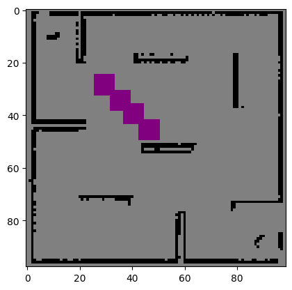
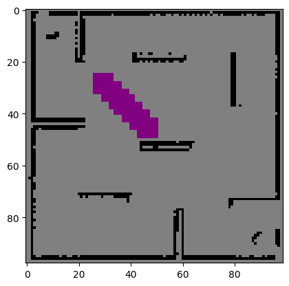
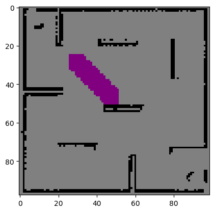
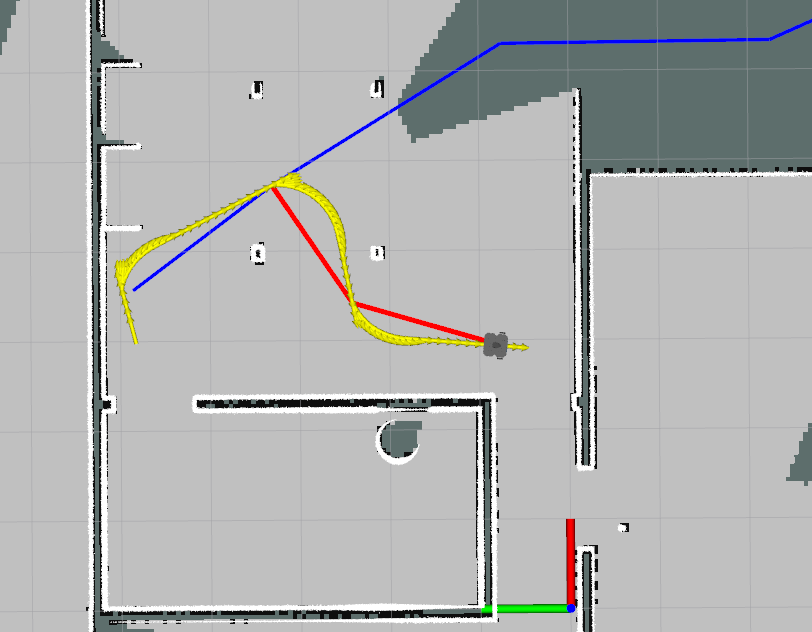
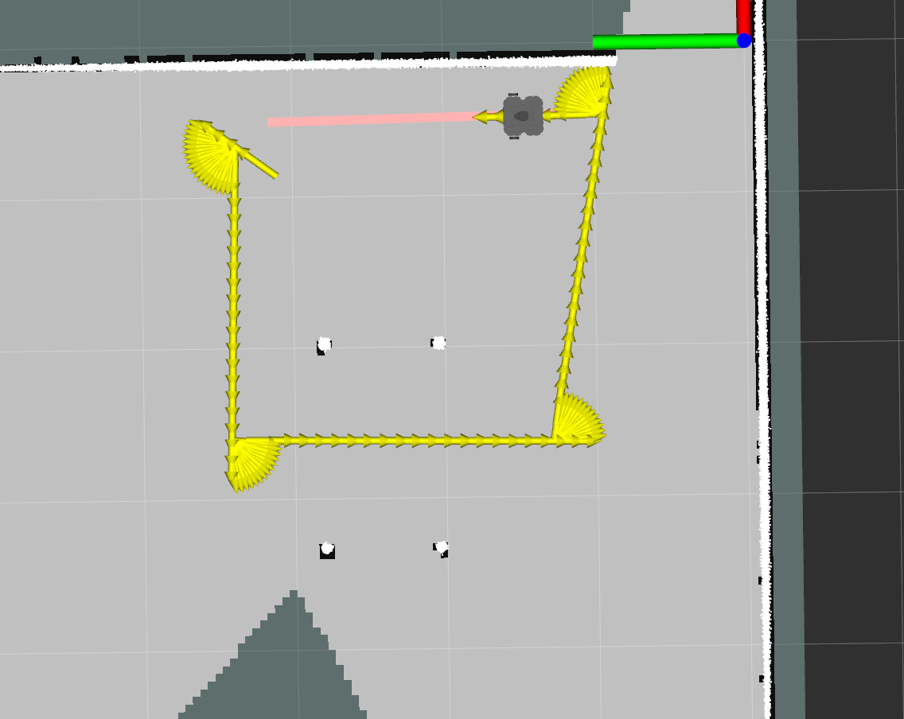
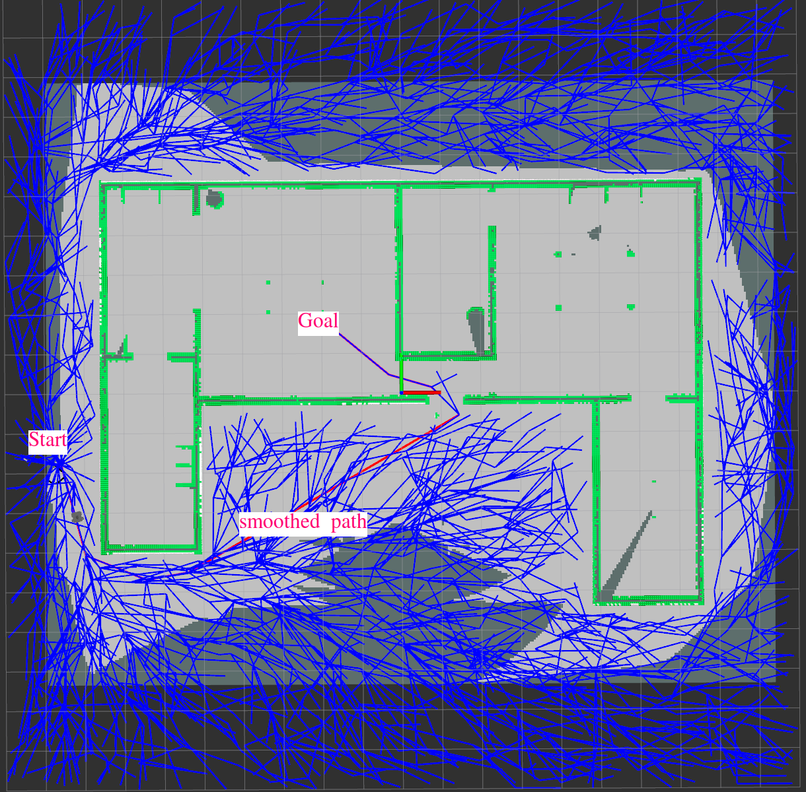
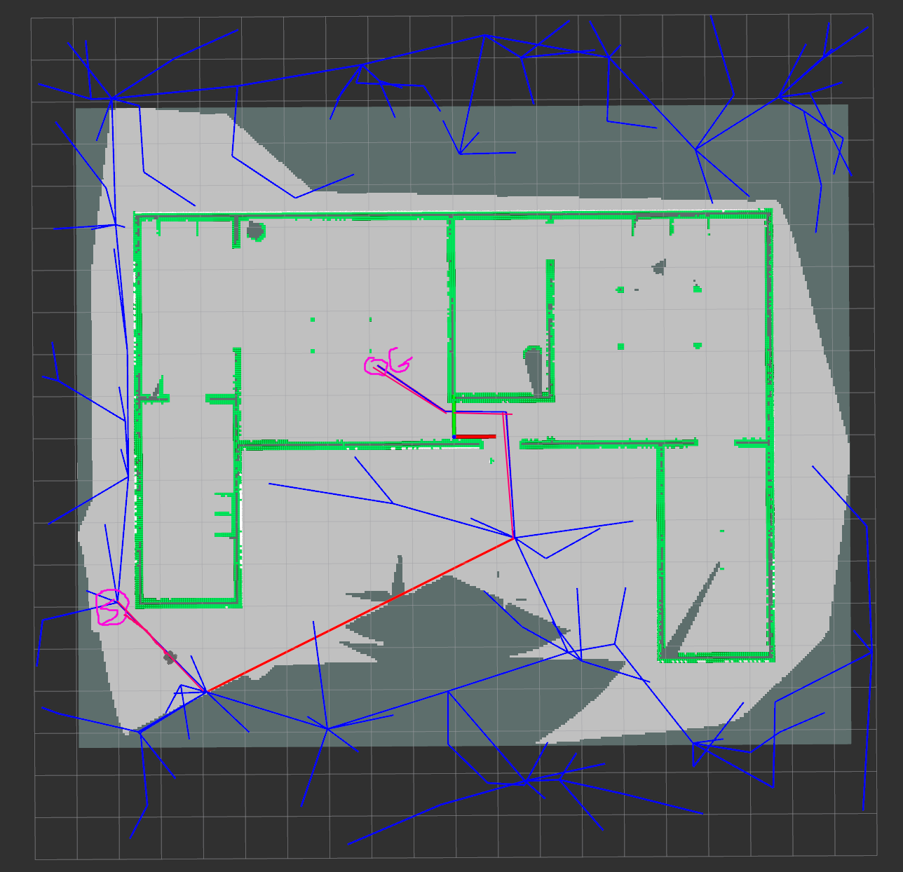
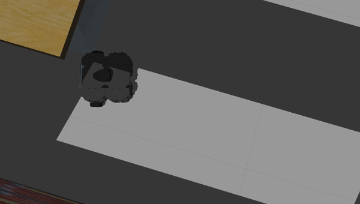

# Online Path Planner lab1

### Group Members 
   1. Eliyas Kidanemariam Abraha - u1992469
   2. Goitom Leaku  u1985499

## Table of Contents
1. [Introduction](#introduction)
2. [Implementation](#features)
3. [Usage](#usage)
4. [Demo Video](#demo)

## Introduction
The lab integrated concepts from occupancy grid mapping and path planning to navigate the robot from its current position to a goal position while avoiding obstacles in the environment. This report presents an overview of the project, its architecture, implementation details, and the delivered package.

## Implementation 
### 

### Task Description 

### 


<div style="display: flex; justify-content: center;">
    <div style="flex: 1; margin-right: 10px;">
        
        <p style="text-align: center;">Figure 1: With step size = 2*distance</p>
    </div>
    <div style="flex: 1; margin-right: 10px;">
        
        <p style="text-align: center;">Figure 2: with step size = distance</p>
    </div>
    <div style="flex: 1;">
        
        <p style="text-align: center;">Figure 3: With step size = 0.5*distance</p>
    </div>
</div>


Figure 4 shows the path of the robot with out first correcting it orientation , this shows the robot is not following the path when it turns. After we add a condition to correct the orientation if the error of the orientation is higher than 0.03 the robot turns on the spot and follow the path correctly.This helps not the robot not to collide  with obstacle whil following a path.

<div style="display: flex; justify-content: center;">
    <div style="flex: 1; margin-left: 10px; 10pxmargin-right: 10px;">
        
        <p style="text-align: center;">Figure 4:with out applying orientation correction </p>
    </div>
    <div style="flex: 1; margin-right: 10px;">
        
        <p style="text-align: center;">Figure 5: Applying Orientation correction first </p>
    </div>
    
</div>

### step-by-step overview of the typical workflow the online path planning 

1. When Goal Positition is given from rvis first we check if the goal position is valid , if it is not valid we can't plan and we send message to give valid goal position.
2. If the current position of the robot is not valid we try to recover the robot to valid position by publishing velocity command to move to the oposite direction of that makes the robot in the invalid state.
3. If the  current position and goal position is valid we initiate path planning  using RRT path planner. 
4. If Path is given from planner we publish velocity command to move the robot to the next waypoint while checking the path is valid path.Beacause we are getting new map from octamap server previously unkown cells may be obstacles we should have to check every time we receive map if the path is correct.if the path is not valid  we initiate new plan to RRT.
5. Checking path and Replanning is done only if we are considering unkown pose as valid pose.
4. If a path from rrt is empty which means the planner can't get a path to the goal point due to different reasons we create a counter for how many times to we should have to try to get a path from planner.if path is not found in that trial we assume there is no valid path betteewen start point and goal point.
6. Beside the  smoothed path  we also publish another marker to draw the tree of the rrt edges this helps us to visulaize everyting.

Below two figures visualizes the RRT tree which is in blue and the 
smoothed path is also shown in red color.
<div style="display: flex; justify-content: center;">
    <div style="flex: 1;">
        
        <p style="text-align: center;">Figure 6: RRT Tree and smoothed path </p>
    </div>
    <div style="flex: 1;">
        
        <p style="text-align: center;">Figure 7: RRT Tree and smoothed path </p>
    </div>

</div>

## RRT Vs RRT*

In this lab we implement both RRT and RRT* , we checked the performance of both planning algorithm.The choice between RRT and RRT* depends on the specific requirements of the planning problem, balancing factors such as planning speed, path optimality, and computational resources. While RRT offers fast exploration but may produce suboptimal paths, RRT* provides the potential for optimal paths at the cost of increased computation. Evaluating the trade-offs between these factors is crucial in selecting the appropriate planner for a given application.

Our recomendation is to use RRT in this particular environmnet, due to complex pbstacles , large areas  RRT STAR is slower specialy with higher redius of rewiring and optimal parent selection.
set is_rrt_star to True to test RRT star 
  ```
   rosparam set /is_rrt_star True
  ```
 
## Otimization 
### Planning Fails 

In the event of planning failure, where a path cannot be obtained from the RRT planner, we implement a counter to track the number of attempts made to find a viable path to a specified goal. Should the initial attempts prove unsuccessful, we iterate through a predetermined number of trials in an endeavor to discover a feasible path. If, path cannot within the allocated number of trials, we conclude that there exists no viable path between the current pose and the goal then we stop planning further more by assuming there is no valid path.

### Robot Recovery 

incacase if the robots current position is invalid. to address this issue we identifie the specific position of the robot the makes it  invalid using the distance_threshold area.Subsequently, we calculates the ideal angle  to rectify the detected invalid pose, ensuring the robot's alignment with its intended trajectory.Finally, the we executes movement commands opposite to the calculated angle, prompting the robot to navigate in the prescribed direction for a predefined duration. 

As shown in the animation below if the robot start position was on obstacle after the robot detects where is the obstacle position it moves oposite to the oposite(in this cas moves backward) it moves and follow the path.
This someimes doesnot work if the robot bounded inside to obstacles.


## Remark 
sometimes the robot sensor lidar does not detect obstacles  below some hieght , for example here the some part of the floor of the table is not detected as obstacel and the robot tryies to pass the as path.somethimes this could happen.


## Usage
  to change parametrs such as is unkown valid  and to use rrt_star as planner - make sure ros master is opened to set param 
  ```sh
  rosparam set /is_unkown_valid True # set is_unkown_valid to true 

  rosparam set /is_rrt_star False  # to use RRT defaault value is RRT
  rosparam set /is_rrt_star True # to use RRT  Star as planning alg  
  ```
  to run the online planner run the follow command 
 ```sh
  
  # to run the online planner 
  roslaunch turtlebot_online_path_planning gazebo.launch
  ```
  <!-- ###  Demo 1
Watch a demo of our project in action: -->

<!-- <video width="640" height="360" controls>
  <source src="./imgs/demo1.mp4" type="video/mp4">
  Your browser does not support the video tag.
</video> -->
## Demo   
Here are youtube video demo of the simulation 
#### Demo1 
 In this the robot moves following the path , when the robot traps its start waypoint to obstacle it moves to free space and follows the path . check the video [1:50 - 2:00] minutes
 
[](https://www.youtube.com/watch?v=q8l0cMO5rNo)

#### Demo 2 with gazebo

[](https://www.youtube.com/watch?v=qbC0dfxiGBA)


### Demo 3

[](https://www.youtube.com/watch?v=YrZ5XiLwfIYs)


